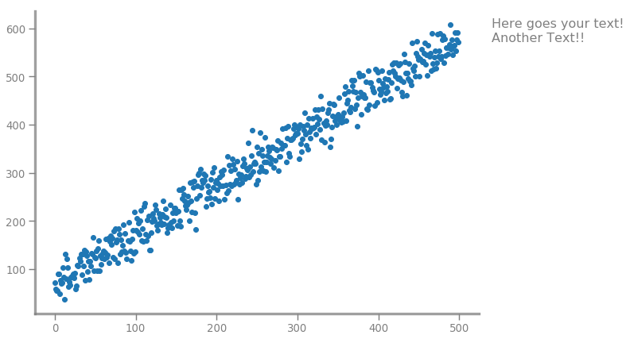

## SWMat - Storytelling With Matplotlib

### A package for making stunning graphs/charts using matplotlib in just a few lines of code!
---

## 1) Installation
Using Pip:
```
    pip install SWMat
```
Download from pypi: [SWMat.tar.gz](https://pypi.org/project/SWMat/#files)

## 2) Import

```
    from SWMat.SWMat import SWMat  # Will change it soon...
```

## 3) Usage

### 3.1 Initialize class:

You can initialize `SWMat` class in two ways:
  - Either you can only pass `matplotlib.pyplot` directly,
```
    import matplotlib.pyplot as plt
    swm = SWMat(plt) # Will take current Axes
```
  - Or you can pass `Axes` with `matplotlib.pyplot` to beautify given `Axes`.
```
    import matplotlib.pyplot as plt
    fig, axs = plt.subplots(3, 4)
    swm = SWMat(plt, ax=axs[0][1])
```

### 3.2 Main features of package

There are 'two' main differentiating features of this package:
  - Base beautifications are done without much hassle,
```
    swm = SWMat(plt) # And... base beautifications will be added.
    plt.scatter(x, y)
```

  - And you can easily plot text on your plot using `SWMat.text`,
```
    swm = SWMat(plt) # This function will initialize your plot
    plt.scatter(x, y)
    swm.text(some_text);  # That's all!! Don't worry there's much more you can do with it.
```



### 3.3 Other Functions:
#### 3.3.1 Line PLot:

Main parameters to look for here are: `line_labels` (Label for each line plot) and `highlight` (int or list of lines to highlight).

```
    swm = SWMat(plt)
    swm.line_plot(xs, ys, line_labels=["A", "B"], highlight=0, lw=3);
```


#### 3.3.2 Hist Plot:

Main parameters to look for here are: `highlight` (int orlist of index of bins to highlight).

```
    swm = SWMat(plt)
    swm.hist(data, highlight=3, bins=bins);
```


#### 3.3.3 Bar Plot:

Main parameters to look for here are: `plot_type` (horizontal, vertical etc), `cat_labels` (labels for categories in each data vector), `data_labels` (labels for each data vector) and `highlight` (dictionary taking int or list of ints for highlighting particular data bars or given category bars).

```
    swm = SWMat(plt)
    swm.bar(cats, heights, data_labels=["A", "B", "C", "D"], cat_labels=["One", "Two", "Three"], highlight={"data":1});
```


```
    swm = SWMat(plt)
    swm.bar(cats, heights, data_labels=["Alpha", "Beta"],  highlight={"data":1, "cat":1},
        cat_labels=["One", "Two", "Three"], plot_type="stacked100%");
```


#### 3.3.4 Violin Plot (Dist PLot):

Main parameters to look for here are: `show` (where violin\dist plot(s) should be shown), `highlight` (dictionary taking list of tuples of starting and ending points inbetween which to highlight, with keys as index of violin plot. Actually you can plot many violin plots simultaneously.)

```
    swm = SWMat(plt)
    swm.violinplot(data, show="top", highlight={"0":[(0.7, 2.3), (4.7, 6)]})
```


#### 3.3.5 Text:

Main feature of text function of SWMat is that you can type in paragraphs of text without using matplotlib's plot function again and again, and that too while using HTML like attribute specification using `prop` tag. So you can configure your text as:

```
    text = "Lorem <prop fontsize='20', color='#FF7700'>ipsum dolor</prop> sit amet." # All attribute's values needs to be inside quotes (As "value" or 'value').
```

`prop` tag can take all attributes of  `fontdict` available in matplotlib.